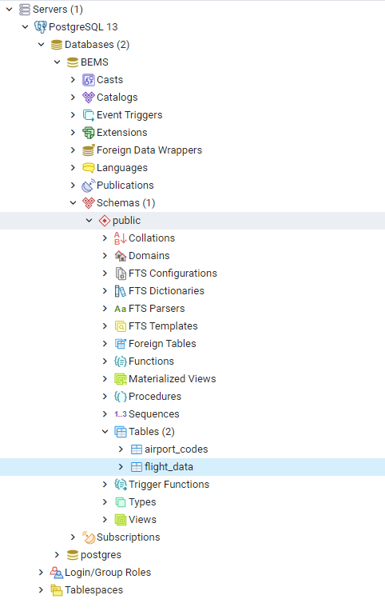
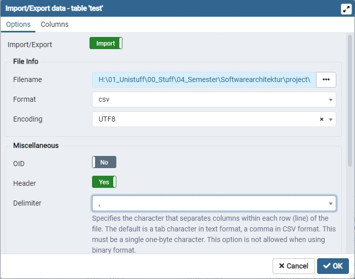
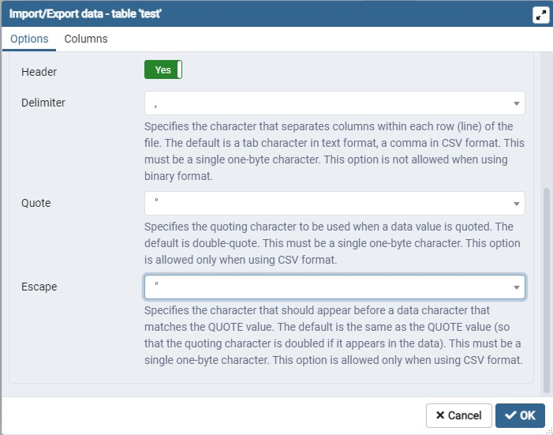

# Backend Dokumentation

Referenzdokumente für die Formel:

- https://www.atmosfair.de/wp-content/uploads/flug-emissionsrechner-dokumentation-berechnungsmethode-1.pdf
- https://www.myclimate.org/fileadmin/user_upload/myclimate_-_home/01_Information/01_About_myclimate/09_Calculation_principles/Documents/myclimate-Flugrechner-Grundlagen_DE.pdf
- https://www.icao.int/environmental-protection/CarbonOffset/Documents/Methodology%20ICAO%20Carbon%20Calculator_v11-2018.pdf

Eine Zusammenfassung der Formel unter [emission_calculator-Formel](code/backend/src/main/java/edu/hm/cs/emission_calculator/doc/emission_calculator-Formel.pdf)
## Datenbank

Benutzt wird eine PostgreSQL Datenbank.

Um den Rechner zu verwenden, muss das [PostgreSQL Programm](https://www.postgresql.org/download/ "download-seite")
heruntergeladen werden (zur erleichterten Benutzung
zusätzlich [pgAdmin](https://www.pgadmin.org/download/ "download pgAdmin") ). Es wird vorausgesetzt, dass lokal ein
Datenbankserver namens "emission_calculator" angelegt ist. Hier muss eine Datenbank "airport_codes" in dem "public" schema existieren.

Die Struktur sollte folglich aussehen: 



### csv Liste importieren

Um die gegebene [csv-liste](code/backend/src/main/resources/airports.csv) zu importieren, führe folgendes SQL in
Postgres aus:

```postgres-sql
CREATE TABLE public."airport_codes" (id integer, indent character varying(20), type character varying(100)
        , name character varying(200), latitudedeg numeric, longitudedeg numeric
        , elevationft integer, continent character varying(20)
        , isocountry character varying(20), isoregion character varying(20)
        , municipality character varying(100), scheduledservice character (20)
        , gpscode character varying(20), iatacode character varying(20)
        , localcode character varying(20), homelink character varying(200)
        , wikilink character varying(200), keywords character varying(1000)
        , PRIMARY KEY (id))

```

```postgres-sql
COPY airport_codes( id, indent,type,name,latitudedeg, longitudedeg, elevationft, continent, isocountry, isoregion,municipality,scheduledservice,gpscode, iatacode,localcode,homelink,wikilink,keywords) FROM '$PATH' DELIMITER ',' CSV HEADER;
```

$PATH = pfad zur airports.csv Datei

oder nachdem eine Tabelle erstellt wurde, Rechtsklick auf die Tabelle airport_codes, auf Reiter Import/Export und
hierüber importieren. Hierbei müssen die Einstellungen folgend gewählt werden:



### Flugdaten

Die Flugdaten Tabelle kann über das folgende sql erstellt werden:
```postgres-sql
create table public."flight_data"(startingdate date ,iatadest varchar(3), destname varchar(100), iatastart varchar(3), startname varchar(100), travelClass varchar(20), authoritynumber integer, authorityname varchar(100), distance numeric , emission numeric, id integer, primary key(id))
```

## Mapping-Ausgabe

Die Klasse FlightController mapt verschiedene Funktionen auf url-Adressen.

z.B:

Ein/e Berechnung/Speichern kann über curl-Befehle ausgeführt werden, hierzu siehe die [curl-example.sh](code/backend/src/main/java/edu/hm/cs/emission_calculator/doc/curl-example.sh "Beispiel curl-Aufrufe") Datei.
Diese zeigt auf, wie alle curl-Befehle aufgerufen werden (kann aber nicht zwingend als eigenes Programm ausgeführt werden).
Alle momentan gespeicherten Daten können mit **http://localhost:8080/api/all** eingesehen werden.

### Mapping-Table
Diese Tabelle zeigt eine Übersicht über alle Rest Funktionen mit Ihren Parametern und einer Beispiel ausgabe.

| Type | url    | Funktion    | Input - Format |  Beispiel - Daten |
|-----	|-----	|----------	| -----	|-----	|
| GET | /api/all    | zeigt alle gespeicherten Daten    |   /    | {"data":[{"destName":"Munich Airport","emission":13.283016877773605,"authorityName":"NameName","distance":9740.80096919702,"iataDest":"MUC","iataStart":"LAX","id":2,"startingDate":"16/05/2021","authorityNumber":123,"travelClass":"business","startName":"Los Angeles International Airport"}]} |
| GET | /api/dashboard  |  Generiert Dashboard daten    |   /    |  {"data":[{"number":1,destName":"Berlin Brandenburg Airport","emission":0.29794928299248413,"authorityName":"Authority","distance":510.6940440674793,"iataDest":"BER","iataStart":"MUC","id":0,"startingDate":"12/05/2021","authorityNumber":123456,"startName":"Munich Airport","travelClass":"business"},{"number":3,"destName":"Los Angeles International Airport","emission":19.959000674609815,"authorityName":"Authority","distance":9258.118281888883,"iataDest":"LAX","iataStart":"DUS","id":1,"startingDate":"05/05/2021","authorityNumber":123456,"startName":"Düsseldorf Airport","travelClass":"economy"}]} |
| POST | /api/data/add    | Berechnet Emissionen anhand der Parametereingaben und speichert Daten    | {"flight":[{"date":"12/05/2021","iataStart":"MUC","iataDest":"BER","class":"business","authorityNumber":123456, "travelling":1}]}    |       {"status":"added"}            |
| GET | /api/search?id=1        |    Sucht nach Eintrag mit id 1    | /   |    {"data":[{"destName":"Düsseldorf Airport","emission":0.30283290638986926,"authorityName":"Dummy-Abteilung","distance":535.8227825966139,"iataDest":"DUS","iataStart":"MUC","id":1,"startingDate":"16/05/2021","authorityNumber":1234,"travelClass":"business","startName":"Munich Airport"}]} |
| GET | /api/search?code=BER        |     Sucht nach Einträgen mit Start oder Landung in BER   |/     |   {"data":[{"destName":"Berlin Brandenburg Airport","emission":0.29794928299248413,"authorityName":"Authority","distance":510.6940440674793,"iataDest":"BER","iataStart":"MUC","id":10,"startingDate":"12/02/2021","authorityNumber":12,"travelClass":"business","startName":"Munich Airport"}]} |
| DELETE | /api/data/1        |   Löscht Eintrag mit id 1     |   /    |    {"status":"removed"} or {"status":"error: data didn't exist"}    |
| DELETE | /api/clear        |  (NUR TESTEN) Löscht gesamte Datenbank    |   /    |     {"status":"cleared"}        |
| POST | /api/calctest        | (NUR TESTEN) Berechnet Flug von MUC nach DUS in business Klasse     | /    |     {"status":"added"}            |
|     	|     	|          	|           	|       |
| POST	| /api/input/create  | Kreiert Datenbank für Einträge  |   / | {"status":"created"} |
| DELETE | /api/input/merge  |  Speichert Daten in flight_data und löscht die temporäre Tabelle | / | {"status":"merged into flight repository"} |
| GET | /api/input/view |  Generiert gehäufte Sicht der gespeicherten Daten (wie Dashboard)	|  / | {"data":[{"number":1,"emission":0.29794928299248413,"destName":"Berlin Brandenburg Airport","authorityName":"Authority","distance":510.6940440674793,"iataDest":"BER","iataStart":"MUC","id":0,"startingDate":"12/05/2021","authorityNumber":123456,"travelClass":"business","startName":"Munich Airport"},{"number":3,"emission":19.959000674609815,"destName":"Los Angeles International Airport","authorityName":"Authority","distance":9258.118281888883,"iataDest":"LAX","iataStart":"DUS","id":1,"startingDate":"12/05/2021","authorityNumber":123456,"travelClass":"economy","startName":"Düsseldorf Airport"}]} |
| POST | /api/input/data/add | Berechnet Emissionen anhand der Parametereingaben und speichert Daten |{"flight":[{"date":"12/02/2021","iataStart":"MUC","iataDest":"BER","class":"business","authorityNumber":123456, "travelling":1}]}|  {"status":"added"}   |
| DELETE |   /api/input/data/1  	|  Löscht Eintrag mit id 1 	| /|  {"status":"removed"} or {"status":"error: data didn't exist"}  |
| POST | /api/input/data  | Updated Eingaben (mitgegeben alte {index 0} und neue {index 1} Flugdaten) |  {"flight":[{"update":[{"date":"12/05/2021","iataStart":"DUS","iataDest":"LAX","class":"economy","authorityNumber":123456},{"date":"12/05/2021","iataStart":"DUS","iataDest":"LAX","class":"economy","authorityNumber":123456,"travelling":3}]}]}|  {"status":"updated"}  |
|     	|     	|          	|           	|    |
| GET    	|   /api/file/download  	| Exportiert alle gespeicherten Daten als downloadbares csv format   	|    /  |   /    |
| GET    	|   /api/file/download?authority=123  , /api/file/download?start=2021/02/01&end=2021/05/03 , /api/file/download?start=2021/02/01 , /api/file/download?start=2021/02/01&end=2021/05/03&authority=1234 	| Exportiert alle gespeicherten Daten als downloadbares csv format, gefiltert nach Parametern     	|    /  |   /    |
|     	|     	|          	|           	|       |
| GET | /airport/iata        |  Zeigt alle Flughäfen mit IATA Daten       | /	|     ... sind zu lang |
| GET | /airport/all        |  Zeigt alle Flughäfen       | /	|    ... sind zu lang    |

Die `id` aus `/dashboard` und `/input/view`beschreibt jeweils das erste Datum in einem "FlightData-Set"
### Parameter
Die Parameter der RestFunktionen sind folgend aufgebaut:

| Name | Funktion | Format |
| --- | --- | --- |
| date | Datum an dem der Flug getätigt wurde | String im format dd/MM/yyyy
| iataStart | iata des Startflughafen | String mit drei großen Buchstaben bsp "MUC"
| iataDest | iata des Zielflughafen  | String mit drei großen Buchstaben bsp "SPC"
| class | Flugklasse | String: "business", "economy", "first-class"
| authorityNumber | Nummer der Abteilung | Integer
| travelling | Anzahl der fliegenden Personen | Integer

